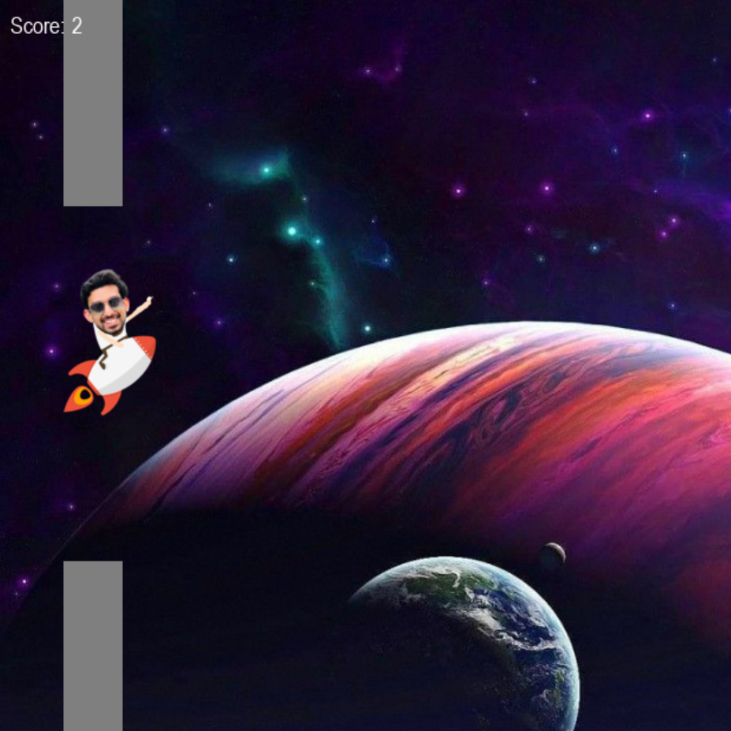
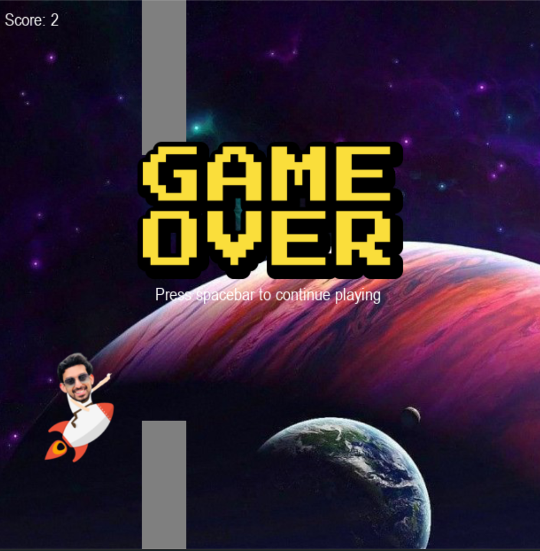

 &nbsp;

# SpaceMan Game

This game is developed in python using the library pygame.Inspired from Flappy Bird game in android.

- Author of this Document : Sunish Surendran Kannembath
- Developer : Sunish Surendran Kannembath
- Reach Sunish in LinkedIn : https://www.linkedin.com/in/sunishsurendrank/
- Reach Sunish in Twitter : @sunishsurendran

# How to play SpaceMan in your machine

### Step 1: 
Clone this repository to your desktop

### Step 2:
Install latest version of python in your machine.

### Step 3: 
Using pip install pygames

`pip install pygames`

### Step 4:
Go to the folder of this repository and open a command promopt in your machine and run the script.

`python.exe .\spaceman.py`

